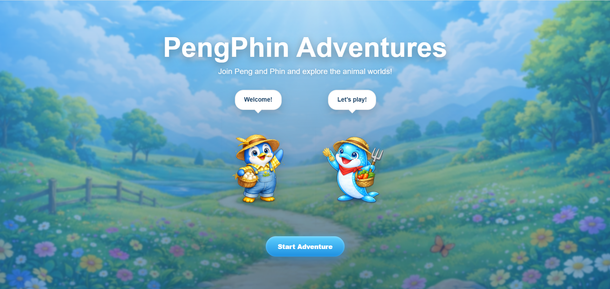
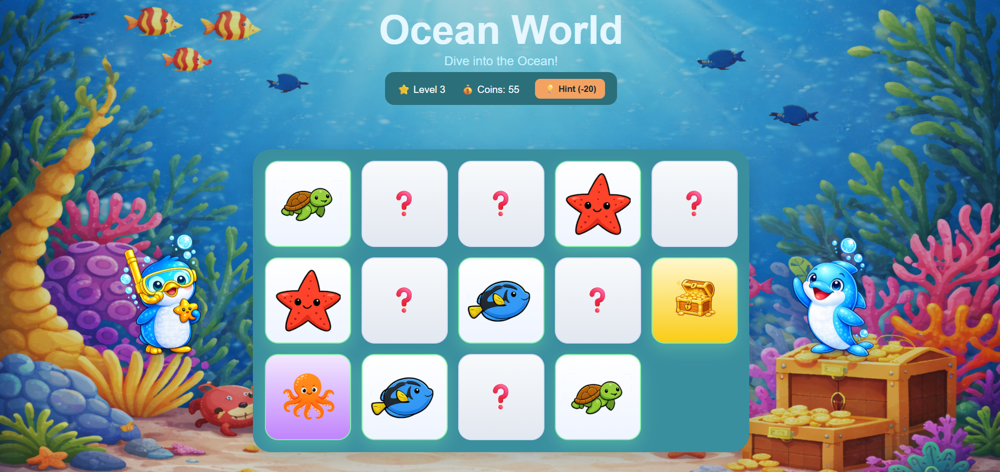

# 🐧🐬 PengPhin Adventures

PengPhin Adventures is a responsive Angular memory game designed for children, combining playful gameplay with thoughtful UX and educational elements.

Players join Peng the penguin and Phin the dolphin on a journey through multiple themed worlds, matching animals, discovering special cards, and progressing through a structured adventure.

---

## 🌱 Why this project

This project started as a way to build something meaningful and fun for my child. The goal was to create a simple but engaging memory game that feels playful, visually clear, and rewarding to interact with.

It is also developed as a portfolio project, focusing on clean Angular architecture, responsive design, and product thinking beyond basic functionality.

---

## 🎮 Features

- Multi-world progression system  
  (Ocean → Farm → Jungle → Arctic → Dinosaur → Space)

- Global level progression across all worlds  
  (continuous level numbering instead of resetting per world)

- Memory-based gameplay with matching mechanics

- Special cards:
  - 🎁 Bonus cards (reward coins)
  - 😈 Mischief cards (introduce unexpected board behavior)

- Hint system to support young players

- Mascot-driven interaction  
  Peng 🐧 and Phin 🐬 guide the player, provide feedback, and enhance engagement

- Basic speech support for character feedback

- Responsive design (mobile, tablet, desktop)

- World-specific visual theming:
  - different backgrounds per world
  - board styling variations
  - score bar styling
  - mascot presentation and UI colors

---

## 🧠 Educational Value

The game is designed with simple educational goals in mind:

- Improve memory and recall
- Support focus and concentration
- Encourage pattern recognition
- Introduce language elements (through future speech and descriptions)

---

## 👶 Real User Testing

The game has been tested with a real young user — my 5-year-old child — helping guide design decisions around interaction, clarity, pacing, and feedback.

This influenced:
- simpler interactions
- clear visual feedback
- accessible and child-friendly gameplay mechanics
- engaging reward systems

---

## 🎮 Progression System

The game uses a structured progression system designed to gradually introduce new mechanics.

### Level Structure

| Level | Mechanics |
|------|----------|
| Level 1 | Pure memory (no special cards) |
| Level 2 | Bonus cards (reward-focused) |
| Level 3 | Bonus + Mischief cards |
| Level 4 | Mischief cards (challenge-focused) |

### 🌍 Worlds

- Ocean
- Farm
- Jungle
- Arctic
- Dinosaur
- Space

### 🔢 Global Progression

Levels are continuous across worlds (not reset per world), creating a stronger sense of progression:

- Ocean → Levels 1–4  
- Farm → Levels 5–7  
- Jungle → Levels 8–10  
- Arctic → Levels 11–13  
- Dinosaur → Levels 14–16  
- Space → Levels 17–19  
- Final Celebration Level → Level 20 (planned, combining animals from all worlds)

---

## 🐧 Mascot System

Peng and Phin are more than visual elements — they are part of the gameplay experience:

- Guide the player through the game
- Provide feedback during gameplay events
- Support onboarding and transitions between worlds
- Add personality and emotional engagement

---

## 🛠️ Tech Stack

- Angular (standalone components)
- TypeScript
- SCSS
- Web Speech API (basic speech support)

---

## 🧩 Architecture Notes

- World content is defined through configuration (`WorldConfig`)
- Levels are structured per world and combined through global progression logic
- UI styling is driven by per-world theme configuration
- Game state is managed through component logic and services

---

## 📸 Screenshots

_(Current version – visuals are actively being improved)_


### Start Screen


### Gameplay (Ocean World)


### Gameplay (Jungle World) - mobile view
<p align="center">
  
</p>

---

## 🚀 Getting Started

Run the project locally:

```bash
ng serve
```

Then open:

http://localhost:4200/

---

## 🐞 Known Issues

- Hint can be triggered multiple times before being consumed (edge case)
- Minor UI polish improvements still in progress
- Some animations and transitions are simplified for now

---

## 🌱 Future Improvements

- Add a final celebration level (Level 20) combining animals from all worlds
- Introduce distinct voices for Peng and Phin
- Improve speech timing and interaction flow
- Add bilingual support (multi-language speech and content)
- Add animations and celebration moments
- Enhance accessibility and interaction polish

---

## 🌍 Vision

PengPhin Adventures aims to grow into a playful, child-friendly learning experience that combines engaging gameplay with strong frontend engineering.

The goal is to balance fun, accessibility, and clean architecture in a project that demonstrates both technical skill and product thinking.

---

## 📄 License

This project is for educational and portfolio purposes.