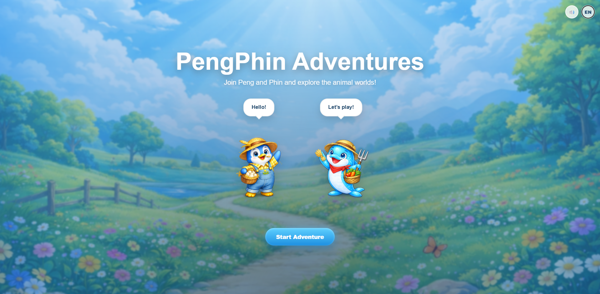
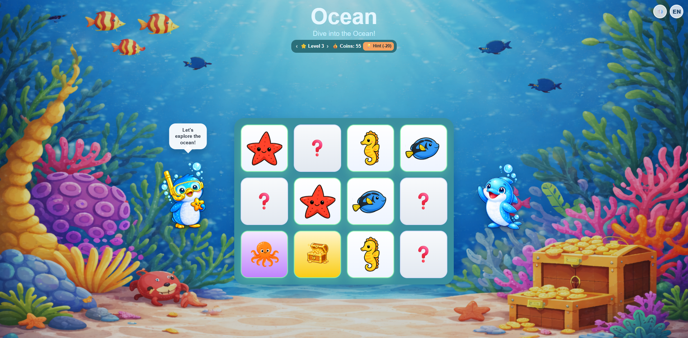
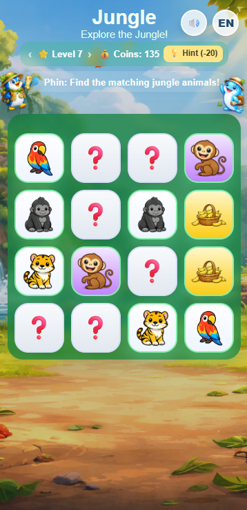

# 🐧🐬 PengPhin Adventures

## 🚀 Live Demo

👉 https://radigirl.github.io/pengphin-adventures/

PengPhin Adventures is a responsive Angular memory game designed for children, combining playful gameplay with thoughtful UX and educational elements.

Players join Peng the penguin and Phin the dolphin on a journey through multiple themed worlds, matching animals, discovering special cards, and progressing through a structured adventure.

---

## 🌱 Why this project

This project started as a way to build something meaningful and fun for my child. The goal was to create a simple but engaging memory game that feels playful, visually clear, and rewarding to interact with.

It is also developed as a portfolio project, focusing on clean Angular architecture, responsive design, and product thinking beyond basic functionality.

---

## 🛠️ Tech Stack

- Angular (standalone components)
- TypeScript
- SCSS
- HTML5 Audio API
- Localized audio assets

---

## 🎮 Features

- Multi-world progression system
  (Ocean → Farm → Jungle → Arctic → Dinosaur → Space → Celebration)

- Global level progression across all worlds  
  (continuous level numbering instead of resetting per world)

- Memory-based gameplay with matching mechanics

- Special cards:
  - 🎁 Bonus cards (reward coins)
  - 😈 Mischief cards (swap positions with another hidden card, or move the first selected card if revealed second)

- Hint system to support young players

- Mascot-driven interaction  
  Peng 🐧 and Phin 🐬 guide the player, provide feedback, and enhance engagement

- 🗣️ Interactive audio experience
  Animals, mascots, and special cards use recorded voice and sound effects to reinforce learning, provide feedback, and make gameplay more engaging for young players.

- 🌍 Bilingual support (English 🇬🇧 / Bulgarian 🇧🇬)  
  All game content is available in both English and Bulgarian, including world descriptions, gameplay messages, and mascot interactions.

- Responsive design (mobile, tablet, desktop)

- World-specific visual theming:
  - different backgrounds per world
  - board styling variations
  - score bar styling
  - mascot presentation and UI colors

---

## 📱 Responsive Design

- Adaptive layout across mobile, tablet, and desktop
- Game board dynamically adjusts rows, columns, and card sizes based on screen size, orientation, and level complexity
- Card sizes scale to maintain usability and visual balance
- Mascots reposition responsively:
  - Desktop: full side placement
  - Mobile: partially hidden “peek” design to preserve space while keeping character presence
- Layout carefully prevents overlap with UI elements (HUD, feedback banner), even for tall boards

---

## 🧠 Educational Value

The game is designed with simple educational goals in mind:

- Improve memory and recall
- Support focus and concentration
- Encourage pattern recognition
- Reinforce language learning through bilingual content and audio feedback

---

## 👶 Real User Testing

The game has been continuously tested with a real young user — my 5-year-old child — helping guide design decisions around interaction, clarity, pacing, difficulty progression, and feedback.

This influenced:
- simpler interactions
- clear visual feedback
- accessible and child-friendly gameplay mechanics
- engaging reward systems

---

## 🎮 Progression System

The game uses a structured progression system designed around increasing board sizes and gradually introducing special card mechanics.

### 🃏 Board Sizes

| Board Size | Total Cards |
|------------|------------|
| 3 × 4 | 12 cards |
| 4 × 4 | 16 cards |
| 4 × 5 | 20 cards |
| 4 × 6 | 24 cards |

### 🎁 Special Cards

The game introduces two special card types:

- 🎁 Treasure Cards — reward bonus coins
- 😈 Mischief Cards — create surprises by moving cards around the board

As players progress, levels combine both mechanics to create additional challenge.

### 🌍 World Progression

| Global Level | World | Cards |
|-------------|--------|--------|
| 1 | Ocean | 12 |
| 2 | Ocean | 12 |
| 3 | Ocean | 12 |
| 4 | Farm | 12 |
| 5 | Farm | 12 |
| 6 | Jungle | 16 |
| 7 | Jungle | 16 |
| 8 | Arctic | 16 |
| 9 | Arctic | 16 |
| 10 | Dinosaur | 20 |
| 11 | Dinosaur | 20 |
| 12 | Space | 20 |
| 13 | Space | 20 |
| 14 | Celebration | 24 |

### 📈 Difficulty Curve

Difficulty increases through:

- Larger board sizes
- Bonus card mechanics
- Mischief card mechanics
- Mixed special-card levels
- A final celebration level combining animals from all worlds

---

## 🐧 Mascot System

Peng and Phin are more than visual elements — they are part of the gameplay experience:

- Guide the player through the game  
- Provide feedback during gameplay events  
- Support onboarding and transitions between worlds  
- Add personality and emotional engagement  

---

## 🧩 Architecture Notes

- World content is defined through configuration (`WorldConfig`)  
- Levels are structured per world and combined through global progression logic  
- UI styling is driven by per-world theme configuration  
- Game state is managed through component logic and services  

---

## 📸 Screenshots

### Start Screen  

### Gameplay (Ocean World)  

### Gameplay (Jungle World) - mobile view  

  

---

## 🚀 Getting Started

Run the project locally:

ng serve

Then open:

http://localhost:4200/

---

## 🌱 Future Improvements

- Add additional worlds, animals, and themed content
- Expand mascot interactions and gameplay events
- Introduce richer animations and celebration moments
- Continue improving usability and interaction polish
- Continue refining the experience through real user testing

---

## 🌍 Vision

PengPhin Adventures aims to grow into a playful, child-friendly learning experience that combines engaging gameplay with strong frontend engineering.

The goal is to balance fun, accessibility, and clean architecture in a project that demonstrates both technical skill and product thinking.

---

## 📄 License

This project is for educational and portfolio purposes.